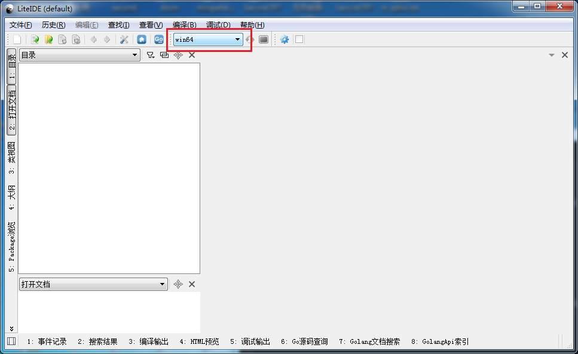

# 开发环境搭建

## 下载 Kongfu 代码

http://gitlab.ztgame.com/tech/Training/Kongfu

在D盘根目录下，执行git clone http://gitlab.ztgame.com/tech/Training/Kongfu.git

## Go语言安装

  1. 从官网下载安装包：goN.n.n.windows-amd64.msi
  1. 双击安装包，一路next，直至安装完毕
  1. 打开控制台，键入go version回车。正确显示版本，则安装成功

## LiteIDE安装

  1. 从官网下载安装包：liteidexNn.windows-qtMm.zip
  1. 解压到d盘，创建liteide.exe的桌面快捷方式
  1. 双击liteide.exe，正常打开程序，则表示安装成功

## 运行 LiteIDE

### 切换当前环境

  

### 打开目录

点击菜单栏：文件 - 打开目录，选择D:\\Kongfu.

### 配置GOPATH路径

点击菜单栏：工具 - 管理GOPATH，使用自定义 GOPATH: D:\Kongfu\server\

关于GOPATH的说明：

- GOPATH路径类似C++的Include目录路径。所有依赖库需要让Go编译器知道，那么可以在GOPATH中配置。
- GOPATH路径有个特点，Go编译器通过GOPATH，真正搜索的路径为 mypath/`src`。如我想把我的依赖库都放到C:/mylib下，并希望Go编译器能正确找到编译。那么你需要做2件事:
    1. 设置GOPATH路径中，增加 C:/mylib
    2. 把你的依赖库，拷贝进C:/mylib/src目录下

### 执行编译

**双击 roomserver.go**；然后按Ctrl+F8；

### 可能的错误
```
go: cannot find GOROOT directory: c:\go
```
Tools -> Edit current environment, 注释或删除该行：
```
GOROOT=c:\go
```
