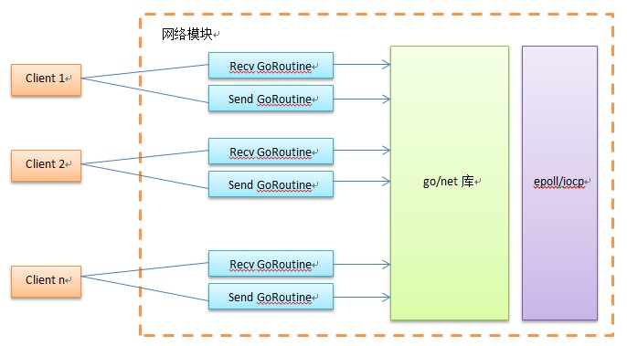

# 网络模块

## 网络编程中的Go语言协程



上图中，假设有N个客户端，那么网络模块就会开2*N个Go协程。

如果有C/C++编程基础的人，可能会感到疑惑，这种网络库模型是否有问题。

这显然受到多线程编程经验的影响了！

协程通过在线程中实现调度，避免了陷入内核级别的上下文切换造成的性能损失。即协程切换时，线程没有被切出去。

代价就是1个协程需要不少内存，至少8K。即通过空间换时间的方式来模拟多线程编程模式

理解Go协程，最简单的方式是，想象每个线程上都有1个协程队列，1个协程要执行阻塞操作了，就把这个协程插到本队列最后，线程没有被切换，且下个协程得到执行。

**重点提示：这里的网络Go协程模型，适用于任何多任务阻塞模块**


## zeus/net

zeus/net库的实现方式，就是上节提到的编程模型。

使用 zeus/net 的例子可以参见：zeus/net/README.md

## 项目中网络模块代码分析 - roomserver.go

### 开启服务

roomserver.go 中，包含了启动网络模块

```go
func (r *RoomServer) Init() bool {
	...
	svr, err := gensvr.New("tcp+kcp", ":9001", 10000)
	r.svr = svr
	...
}
```

### 运行
```go
func (r *RoomServer) Run() {
	r.svr.Run()
}
```

### 处理网络消息

`gen/gensvr/proc/Proc_wilds.go` 是消息处理逻辑

```go
func (m *Proc_wilds) MsgProc_MsgMove(msg *usercmd.MsgMove) {
	if m.CheckPlaying() == false {
		return
	}

	m.room.PostAction(func() {
		m.scenePlayer.OnNetMove(msg)
	})
}
```

### 发送消息
```
func (p *Proc_wilds) MsgProc_ClientHeartBeat(msg *usercmd.ClientHeartBeat) {
	p.sess.Send(msg)
}
```

```
// 发送普通消息
func (s *ScenePlayer) Send(msg server.IMsg) bool {
	if s.Sess == nil {
		return false
	}
	s.Sess.Send(msg)
	return true
}
```
