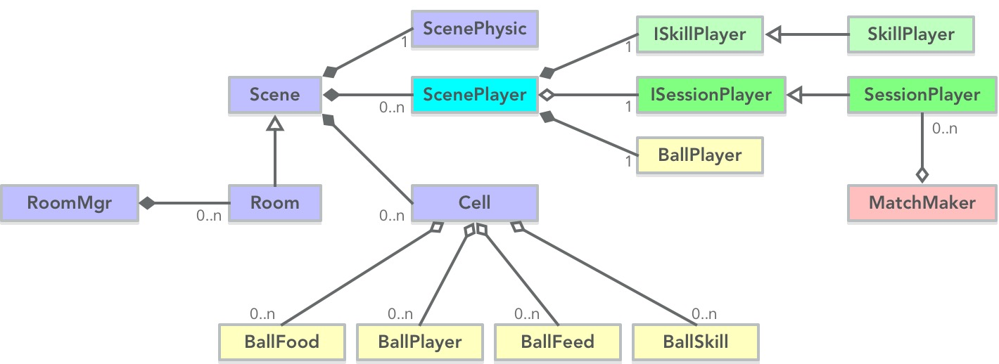

### 类关系图

上图使用了写UML标志，这里稍作下说明

符号        | 说明
------------|-------------------------------
直线空心箭头 |在UML中表示继承关系，Go语言中的“组合嵌入”这种新事物UML中没有，这里暂用直线空心箭头来表示。
直线实心菱形 |表示强包含，比如RoomMgr销毁了，其管理的所有Room也会被销毁
直线空心菱形 |表示弱包含，表示对某有引用

下面对每个类做下说明

### RoomMgr

房间管理类，负责对房间的一些操作，如

  - 创建房间
  - 超时销毁房间

等等

### Room

房间类，负责处理房间的一些逻辑，如

  - 玩家加入房间
  - 玩家离开房间
  - 玩家消息投递到本房间处理
  - 房间主循环

等等

### Scene

场景类，房间类“组合嵌入”了场景类。即房间同时也是一个场景。

场景类主要负责：

   - 场景物理层
   - 场景构建
   - 管理玩家、其他游戏对象
   - 管理场景Cell

### ScenePhysic

场景物理层，使服务器可以模拟碰撞等

### Cell

场景网格类，通过Cell管理玩家，使玩家AOI系统可以运作起来

### ScenePlayer

玩家类，通常玩家类会很复杂，所以可以通过它“包含”玩家各模块功能。达成代码结构上清晰的目的

### Ball*

表示场景中的各种游戏对象。AOI系统的基本单位

### \*SkillPlayer

玩家技能类

### SessionPlayer

表示玩家网络会话类

### MatchMaker

游戏匹配功能管理器
