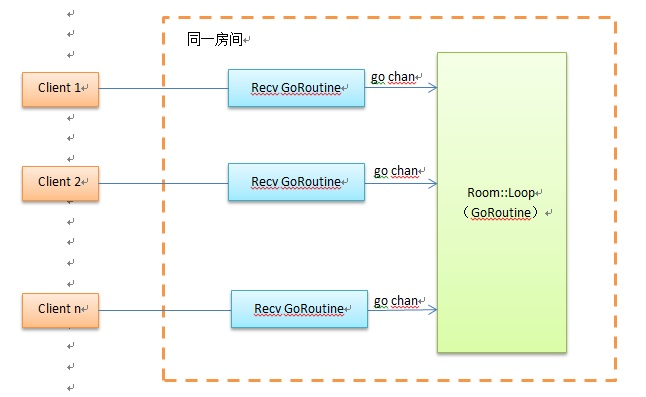

### 多协程同步模型



在Go程序启动时，指定了多核多线程运行模式下，每个协程都可能被投递到不同的线程上被执行。

类似多线程编程，需要考虑访问互斥资源的问题。

常见的，会使用互斥锁等机制，来处理这类问题。Go语言也是支持的。

同时，Go语言提供了chan机制，也就是上图中所画的模型。

这种同步模型的好处有：

  - 相关的逻辑都在1根主协程中执行，从而把相关逻辑变成了同步编程。
  - 其他协程通过chan，类似投递消息的方式，与主协程互动。即不直接操纵互斥资源，从而避免了访问互斥问题。

**此外，与一些常见的游戏框架比，一些游戏框架会把所有业务逻辑串行执行。**

**而这种模型，则是把1个房间内的游戏逻辑串行化。从而使所有房间的游戏逻辑并行执行。这样可以更好的利用CPU了**

### 项目代码示例分析 - Room.Loop 与 Room.actC

我们来看下RoomServer，从收到玩家移动消息（MsgMove），经过 chan（Room.actC），到房间主循环执行的过程

- 客户端发送MsgMove消息，玩家移动消息被触发
    ```go
    func (m *Proc_wilds) MsgProc_MsgMove(msg *usercmd.MsgMove) {
        if m.CheckPlaying() == false {
            return
        }

        m.room.PostAction(func() {
            m.scenePlayer.OnNetMove(msg)
        })
    }
    ```

- PostAction 函数
    ```go
    func (r *Room) PostAction(action func()) {
        r.actC <- action
    }
    ```
  func() { m.scenePlayer.OnNetMove(msg) } 匿名函数对象，通过 PostAction 函数调用，传递给 Room.actC

- 房间主循环执行从 Room.actC 投递来的匿名函数
    ```go
    func (r *Room) Loop() {
        // ... 省略无关代码 ...
        for {
            select {
            // ... 省略无关代码 ...
            case act := <-r.actC:
                act()
            // ... 省略无关代码 ...
            }
        }
    }
    ```
  act() 即为执行 匿名函数对象：func() { m.scenePlayer.OnNetMove(msg) }

整个过程：

  - 客户端发送 MsgMove 消息 => 协程 SessionPlayer.recvLoop 接收此消息
  - 协程 SessionPlayer.recvLoop => 触发 MsgProc_MsgMove 函数执行
  - 匿名函数对象 func() { m.scenePlayer.OnNetMove(msg) } => 投递给 chan Room.actC
  - 协程 Room.Loop 从 chan Room.actC 读取 匿名函数对象 func() { m.scenePlayer.OnNetMove(msg) }，执行之

以上
