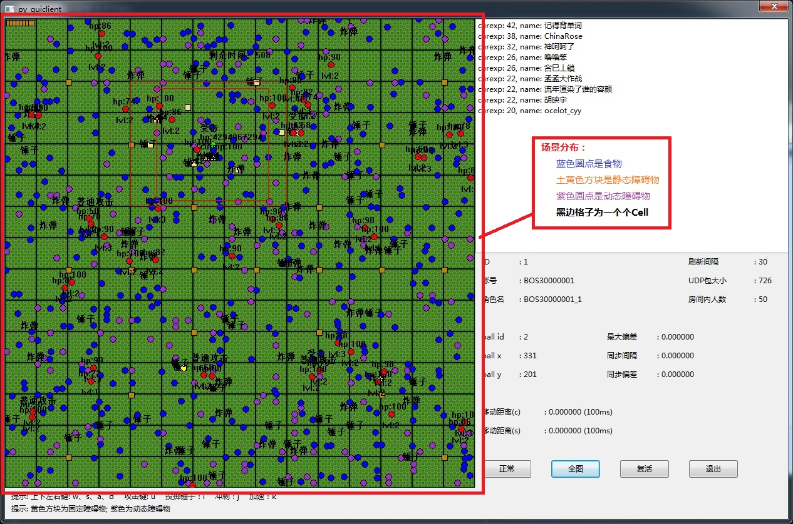

### 场景中的同步数据量

服务器网络带宽方面占比最重的一块就是`场景中的同步数据`

可以设想下面的情景：
  - 玩家进入场景后，需要看见其他玩家，那么在完全没有优化过的情况下，只能是全地图玩家数据广播给该玩家。
  - 所有的玩家都在移动，那么服务器需要对每个玩家发送其他玩家数据。流量复杂度为 n&times;(n-1)，即 O(n<sup>2</sup>)

因此需要一些算法来减少场景中数据的发送量。


### 游戏中的玩家视野（AOI系统）

通过模仿现实人类视野的概念，可以有效的减少要发送的数据。

这样的系统，通常被称为AOI（area of interest）。

AOI系统的引入，主要为了解决下面的几个问题：

  - **减少场景数据发送量**
  - **减少玩家与其他游戏对象互动时需要消耗的CPU占用率**

在代码实现中，有些著名的AOI算法：

算法         | 应用                               | 说明
-------------|-----------------------------------|-------------------------
十字链法      | 开源项目 KBEngine                 | 场景组织方式不基于格子的。
灯塔         | 征途系列、球球系列、光荣使命         | 通过灯塔维护场景中的游戏对象，每个玩家自己维护视野相关信息
QTree/Octree | 各种客户端游戏引擎、服务器端也用     | 通过四叉树、八叉树组织场景中的游戏对象。

灯塔算法有很多变种：

应用    | 说明
--------|------------------------------------
征途系列 | 九宫格算法
光荣使命 | 九宫格算法
球球系   | 因为看不到原版，不好下定论
本项目   | 没有9屏概念。通过前后2帧视野快照，获得场景变化信息


下面将针对本项目的灯塔算法变种做下介绍


### Cell具象化、视野具象化




上图中，每个黑格子，就是一个 Cell。

### 实现细节

在灯塔算法中，将场景划分为1个个 Cell（正确的名称叫 Tower 更为合适）

并按照分而治之的原则，通过 Cell 为单位维护玩家信息。

同时，玩家身上维护当前帧可以看到的游戏对象列表快照A。

那么每一帧（即下一帧），玩家重新获取当前最新能看到的游戏对象列表B。对比A与B的变化，玩家即可知道场景中的所有变化情况。

详细的：
  - **玩家进入场景**，则根据视野大小获取玩家所有灯塔，将灯塔维护的数据发给玩家

  - **每帧**，根据视野大小获取玩家所有灯塔维护的数据，并与上次数据快照做比较。从而获得所有场景变化信息

  - **玩家与视野内游戏对象互动**，根据视野大小获取玩家所有灯塔维护的数据。再遍历这些数据


### 项目Cell代码分析 - Cell.go

- Cell数据结构
    ```go
    type Cell struct {
      id            int                        // Cell编号
      rect          util.Square                // Cell地图中的位置、区域
      Foods         map[uint32]*bll.BallFood   // 该Cell上的食物球
      playerballs   map[uint32]*bll.BallPlayer // 该Cell上的玩家球
      Feeds         map[uint32]*bll.BallFeed   // 该Cell上的动态障碍物
      Skills        map[uint32]*bll.BallSkill  // 该Cell上的技能球
      MsgMoves      []*usercmd.BallMove        // 语义上非必须，一些优化手段
      msgMovesMap   map[uint32]int             // 语义上非必须，一些优化手段
      msgRemovesMap map[uint32]bool            // 语义上非必须，一些优化手段
      msgAddsMap    map[uint32]bool            // 语义上非必须，一些优化手段
    }
    ```
    Scene划分为N个Cell，每个Cell维护自身上面的各种球对象

- 一系列 Cell.Find* 函数

    实现一系列获取该Cell上球列表的方法


### 项目视野代码分析 - ScenePlayerViewHelper.go

- View的数据结构

    ```go
    type ScenePlayerViewHelper struct {
      ViewRect       *util.Square                    // 玩家视野大小
      RealViewRect   util.Square                     // 玩家视野（根据玩家原始视野得到所有cell的外边框）
      LookCells      map[int]*cll.Cell               // 根据玩家原始视野得到所有cell集合
      LookFeeds      map[uint32]*bll.BallFeed        // 视野中的feed（用于sendSceneMsg）
      LookBallSkill  map[uint32]*bll.BallSkill       // 视野中的技能球（用于sendSceneMsg）
      LookBallPlayer map[types.PlayerID]*ScenePlayer // 视野中的玩家 （用于sendSceneMsg）
      LookBallFoods  map[uint32]*bll.BallFood        // 视野中的food（用于sendSceneMsg）
      Others         map[types.PlayerID]*ScenePlayer // 视野中其它玩家
      RoundPlayers   []*ScenePlayer                  // 周围玩家，包含死亡玩家
    }
    ```
    可以看到，ScenePlayerViewHelper来维护玩家视野内各种球的快照

- 函数 ScenePlayerViewHelper.UpdateView
    ```go
    func (this *ScenePlayerViewHelper) UpdateView(scene IScene, selfBall *bll.BallPlayer, sceneSize float64, cellNumX, cellNumY int) {
      // 没有动过，直接返回
      if math.Abs(selfBall.GetRect().X-this.ViewRect.X) < util.EPSILON &&
      	math.Abs(selfBall.GetRect().Y-this.ViewRect.Y) < util.EPSILON {
      	return
      }
    
      // TODO : 视野调整，具体需要等客户端确定好摄像机后，再根据手机各分辨率下，找一个最大包含屏幕的区域大小。
      //        目前为了可以适配py_guiclient，暂时修改如下
      this.ViewRect.CopyFrom(selfBall.GetRect())
      this.ViewRect.SetRadius(9)
    
      // 如果想地图全开：this.ViewRect.SetRadius(sceneSize * 10)
    
      this.RealViewRect.CopyFrom(this.ViewRect)
      minX := int(math.Max(math.Floor(this.RealViewRect.Left/cll.CellWidth)*cll.CellWidth, 0))
      maxX := int(math.Min(math.Floor(this.RealViewRect.Right/cll.CellWidth)*cll.CellWidth, float64(cellNumX-1)*cll.CellWidth))
      minY := int(math.Max(math.Floor(this.RealViewRect.Bottom/cll.CellHeight)*cll.CellHeight, 0))
      maxY := int(math.Min(math.Floor(this.RealViewRect.Top/cll.CellHeight)*cll.CellHeight, float64(cellNumY-1)*cll.CellHeight))
      this.RealViewRect.Left = float64(minX)
      this.RealViewRect.Right = float64(maxX) + cll.CellWidth
      this.RealViewRect.Bottom = float64(minY)
      this.RealViewRect.Top = float64(maxY) + cll.CellHeight
    
      newCells := scene.GetAreaCells(this.ViewRect)
      this.LookCells = make(map[int]*cll.Cell)
      for _, newCell := range newCells {
      	this.LookCells[newCell.ID()] = newCell
      }
    }
    ```
    玩家位置变化，会调用该方法，来更新玩家最新的视野范围

- 一系列 ScenePlayerViewHelper.UpdateVeiw* 函数

    更新玩家视野中的各类球快照

- 一系列 ScenePlayerViewHelper.Find* 函数

    方便获取玩家视野中有哪些球信息
