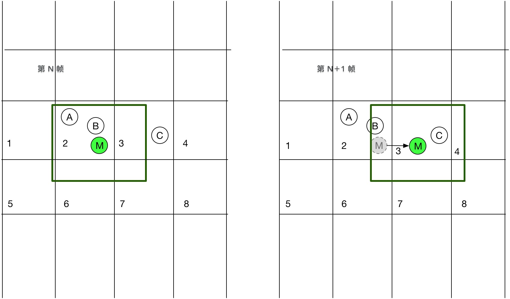

### 图解过程



上图，1 - 8 ，白色方格表示Cell；绿色框表示玩家 M 的视野。

在第 N 帧，玩家 M 看见 A 、 B 。
第 N+1 帧，玩家 M 的新位置先被计算。然后开始更新视野。
主要做如下事情：

- 计算玩家新视野边框，如图中第 N+1 帧的绿色框的位置
- 根据新视野边框，获取当前视野覆盖下的所有 Cell ： 2 、3 、 4 、 6 、 7 、 8
- 遍历 Cell ： 2 、3 、 4 、 6 、 7 、 8 上的玩家，与新视野边框做相交测试。确定能看见：B 、 C
- 比较第 N 帧看到的快照 A 、 B ，与现在看到 B 、 C ，则可以得出 A 离开视野；C进入视野。


### 代码分析 - ScenePlayer.Update

每帧调用 ScenePlayer.Update

```go
func (s *ScenePlayer) Update(perTime float64, now int64, scene IScene) {
	// ... 无关代码略 ...

	// 玩家球移动
	s.UpdateMove(perTime, frameRate)

	s.UpdateView(scene)

	// ... 无关代码略 ...

	// 更新视野中的玩家
	s.UpdateViewPlayers(scene)

	// ... 无关代码略 ...
}
```

- 更新玩家位置（s.UpdateMove(perTime, frameRate)）
- 更新玩家视野边框（s.UpdateView(scene)）
- 更新玩家视野中的玩家快照（s.UpdateViewPlayers(scene)）


### 代码分析 - 视野中玩家快照管理

- 数据结构

	```go
	type ScenePlayerViewHelper struct {
		// ... 无关字段略 ...
		LookBallPlayer map[types.PlayerID]*ScenePlayer // 视野中的玩家 （用于sendSceneMsg）
		// ... 无关字段略 ...
		Others         map[types.PlayerID]*ScenePlayer // 视野中其它玩家
		// ... 无关字段略 ...
	}
	```
	LookBallPlayer 字段用来保存上一帧视野中的玩家； Others 字段用来保存本帧视野中的玩家

- ScenePlayer.UpdateViewPlayers
  
    该函数更新本帧视野中的玩家。即更新 Others 字段

- ScenePlayer.SendSceneMsg

	```go
	func (s *ScenePlayer) SendSceneMsg() {
		// ... 无关代码略 ...
		addplayers, delplayers := s.updateViewBallPlayer()
		AddPlayers = append(AddPlayers, addplayers...)
		RemovePlayers = append(RemovePlayers, delplayers...)
		// ... 无关代码略 ...
	}
	```
	s.updateViewBallPlayer() 比较 LookBallPlayer 、 Others 字段，得到 addplayers, delplayers

- 保存本帧视野中的玩家到 LookBallPlayer 字段

	```go
	func (this *ScenePlayerViewHelper) ResetMsg() {
		this.LookBallPlayer = make(map[types.PlayerID]*ScenePlayer)
		for k, v := range this.Others {
			this.LookBallPlayer[k] = v
		}
	}
	```
	所有 ScenePlayer.SendSceneMsg 执行完毕后，会调用 ResetMsg 保存视野中玩家快照

### 视野中的其他球

如食物球、动态障碍物等等，都是类似逻辑处理。

略
